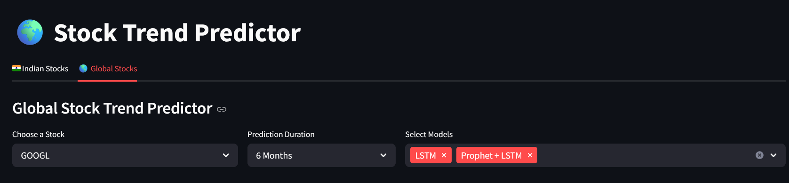
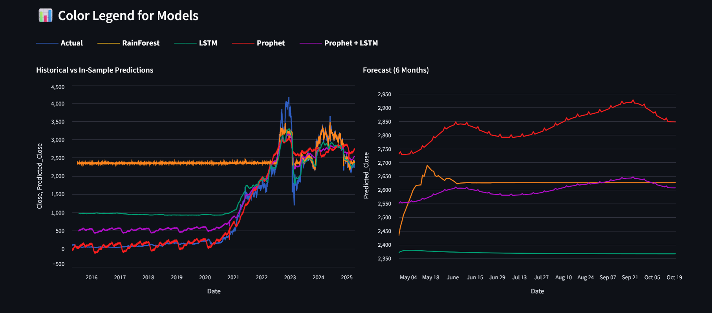
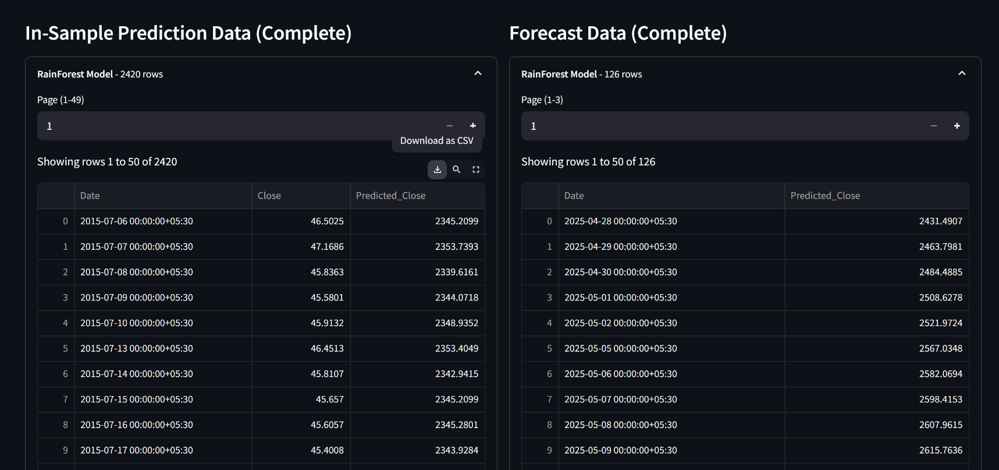

# 📈 Stock Market Prediction Website

Welcome to the **Stock Market Prediction App** — a full-featured stock trend prediction platform using **Machine Learning** and **Deep Learning** models.

It supports:
- Traditional models like **Random Forest**
- Deep learning models like **LSTM**
- **Prophet** for time-series forecasting
- Side-by-side model comparisons for global and Indian markets!

---

## 🚀 Features

- **Predict stock trends** globally and for Indian stocks (NSE).
- **Multiple models** supported:
  - Random Forest (ML)
  - LSTM (Deep Learning)
  - Prophet (Time-Series Forecasting)
- **Future Forecasting** for upcoming months
- **Visualization** of trends and model components
- **Streamlit UI** for easy interaction
- **Auto noise smoothing** for more realistic forecasts
- Works with **both global stocks** (via `yfinance`) and **Indian stocks** (via `nsepy`).

---

## 📈 Screenshots





---

## 📦 Requirements

Install dependencies with:

```bash
pip install -r requirements.txt
```

**requirements.txt:**

```
pandas
numpy
matplotlib
seaborn
scikit-learn
yfinance
nsepy
xgboost
streamlit
tensorflow
prophet
```

---

## 🛠️ Project Structure

```
├── app/
    └──streamlit_app.py  # Streamlit dashboard app
    └──utils.py          # Functions for prophet
├── data/
│   └── global/          # CSV stock data for global stocks
│   └── india/           # CSV stock data for Indian stocks
├── models/
│   └── global/          # Trained models for global stocks (Random Forest, LSTM)
│   └── india/           # Trained models for Indian stocks
├── fetchdata.py         # To fetch stock data in CSV
├── rf_predict.py        # Random Forest prediction scripts
├── lstm_predict.py      # LSTM deep learning prediction scripts
├── prophet_predict.py   # Prophet forecasting scripts
├── preprocess.py        # Feature engineering utilities   
├── requirements.txt
├── train_model.py       # For training Random Forest
├── train_lstm.py        # For training LSTM
```

---

## 📊 Models and How They Work

| Model    | Type               | Strengths                           |
|----------|--------------------|-------------------------------------|
| Random Forest | Machine Learning | Good on historical feature patterns |
| LSTM      | Deep Learning      | Learns sequential trends and patterns |
| Prophet   | Time-Series Model  | Captures seasonality and trend changes |

---

## 🚀 Running the App

First, make sure you have your models trained and saved in `/models`.

Then, run:

```bash
streamlit run streamlit_app.py
```

It will open the dashboard automatically in your browser! 🌟

---

## ⚙️ Training New Models

- Train **Random Forest** models separately (using your own scripts or notebooks).
- Train **LSTM** models and save `.h5` models along with corresponding scalers (`joblib` format).
- Prophet automatically retrains based on the selected stock.

---


## 📜 License

This project is licensed under the MIT License - feel free to use, modify, and share!

---
